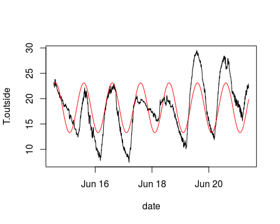
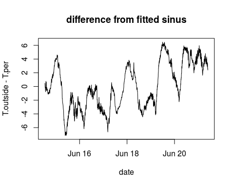
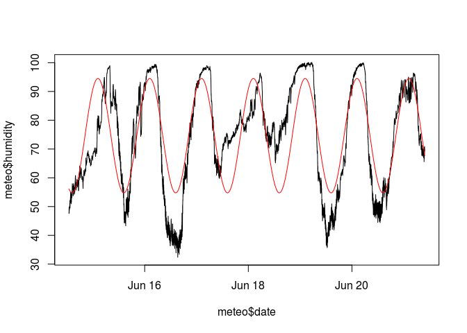
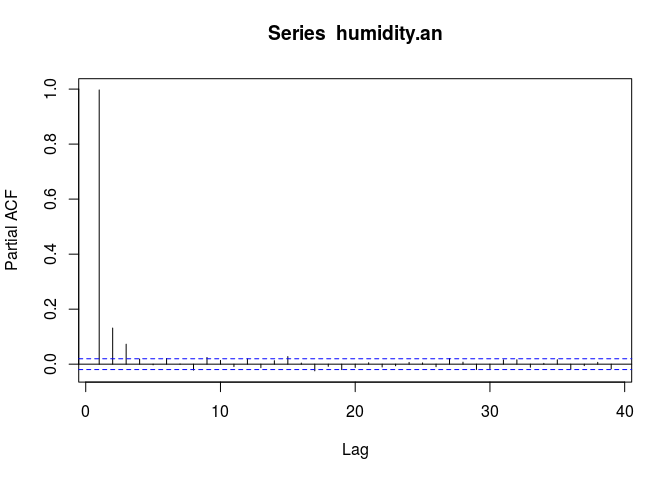
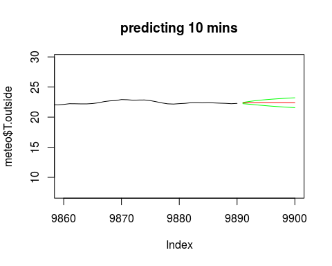
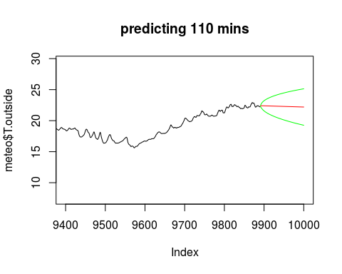
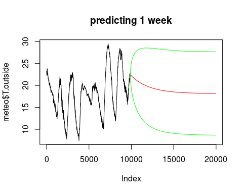
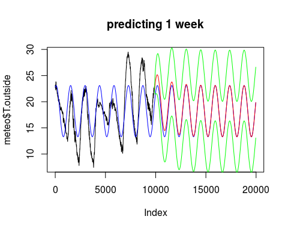

Spatio-temporal Modelling, Lab 2, 2015-11-05
============================================

This excercise is about exploratory time series analysis, fitting
periodic components, and AR models. You will need to download the R data
file `meteo.Rdata` from the Learnweb and put it into your workspace
directory.

Exploratory Time Series Analysis
--------------------------------

You can load the **RData** file in R using the **load** function. The
**class** function allows you to retrieve the class of an R object. In
this case, the data is loaded as a
[data.frame](http://cran.r-project.org/doc/manuals/r-release/R-intro.html#Data-frames).

    load("meteo.RData")
    class(meteo)

    ## [1] "data.frame"

    summary(meteo)

    ##        ID           year        julian.day         time     
    ##  Min.   :100   Min.   :2007   Min.   :165.0   Min.   :   0  
    ##  1st Qu.:100   1st Qu.:2007   1st Qu.:167.0   1st Qu.: 553  
    ##  Median :100   Median :2007   Median :169.0   Median :1146  
    ##  Mean   :100   Mean   :2007   Mean   :168.6   Mean   :1177  
    ##  3rd Qu.:100   3rd Qu.:2007   3rd Qu.:170.0   3rd Qu.:1806  
    ##  Max.   :100   Max.   :2007   Max.   :172.0   Max.   :2359  
    ##    T.outside        pressure         humidity            X            
    ##  Min.   : 7.43   Min.   :-76.80   Min.   : 32.38   Min.   :-6999.000  
    ##  1st Qu.:14.90   1st Qu.:-71.50   1st Qu.: 61.16   1st Qu.:   -0.974  
    ##  Median :18.45   Median :-70.20   Median : 77.00   Median :   42.840  
    ##  Mean   :18.13   Mean   :-70.39   Mean   : 74.89   Mean   :  201.757  
    ##  3rd Qu.:20.86   3rd Qu.:-68.97   3rd Qu.: 90.90   3rd Qu.:  323.775  
    ##  Max.   :29.51   Max.   :-65.52   Max.   :100.10   Max.   : 1172.000  
    ##    windspeed        std.dev.        Wind.dir       std.dev..1    
    ##  Min.   :0.000   Min.   :0.000   Min.   :  0.0   Min.   : 0.000  
    ##  1st Qu.:0.355   1st Qu.:0.334   1st Qu.:126.6   1st Qu.: 0.206  
    ##  Median :0.793   Median :0.770   Median :173.5   Median : 8.155  
    ##  Mean   :1.115   Mean   :1.075   Mean   :184.4   Mean   : 9.468  
    ##  3rd Qu.:1.584   3rd Qu.:1.520   3rd Qu.:262.8   3rd Qu.:14.630  
    ##  Max.   :6.876   Max.   :6.361   Max.   :360.0   Max.   :76.900  
    ##  TippingBucket           mins           hours       
    ##  Min.   :0.000000   Min.   : 0.00   Min.   : 14.92  
    ##  1st Qu.:0.000000   1st Qu.:14.00   1st Qu.: 56.10  
    ##  Median :0.000000   Median :29.00   Median : 97.31  
    ##  Mean   :0.002144   Mean   :29.48   Mean   : 97.31  
    ##  3rd Qu.:0.000000   3rd Qu.:44.00   3rd Qu.:138.51  
    ##  Max.   :1.600000   Max.   :59.00   Max.   :179.72  
    ##       date                         T.per      
    ##  Min.   :2007-06-14 12:55:00   Min.   :13.30  
    ##  1st Qu.:2007-06-16 06:06:15   1st Qu.:14.69  
    ##  Median :2007-06-17 23:18:30   Median :18.05  
    ##  Mean   :2007-06-17 23:18:30   Mean   :18.14  
    ##  3rd Qu.:2007-06-19 16:30:45   3rd Qu.:21.62  
    ##  Max.   :2007-06-21 09:43:00   Max.   :23.10

*Hint:* In case the RData file is not in working directory, you may have
to specify the absolute path (e.g. C:/myDirectory/meteo.RData in
Windows), but we recommend you to set the working directory properly
using the **setwd** function or an R Studio project.

Again, we can generate a plot using the **plot** function:

    plot(T.outside ~ date, meteo, type = "l")

<!-- -->

**T.outside** and **date** are both contained in the meteo data as
columns (see the output of **summary** above). In order to state that
the temperature outside should be plotted against the dates, we pass the
**T.outside ~ date** expression to the plot function as first parameter,
then indicate that both are part of the meteo dataset (second
parameter), and the third paramter **type="l"** is the same as described
above.

Fitting a periodic component
----------------------------

For fitting the periodic component for exercise 3, a new function with
name **f** is defined. In general, we can define functions in R using
the following syntax:

    funcMultiply = function(x,y){x*y}
    z = funcMultiply(3,4)
    z

    ## [1] 12

In the example above, we define a new function called **funcMultiply**
that multiplies two numbers. The two numbers are passed to the function,
indicated by **function(x,y)**. If we then invoke funcMulitply with the
numbers 3 and 4, we get the result 12.

We may also pass vectors to a function. Taking the example of a multiply
function, we may also pass a vector with two numbers.

    funcMultiplyVector = function(x){x[1]*x[2]}
    inputVector = c(3,4)
    z = funcMultiplyVector(inputVector)
    z

    ## [1] 12

*Hint:* In the example for exercises 3 and 4, the second approach, where
a vector is passed to the function is implemented.

The meteo dataset is loaded as a
[data.frame](http://cran.r-project.org/doc/manuals/r-release/R-intro.html#Data-frames)
in R. The **summary** function lists all columns with summary
statistics. We can easily add a new column computed from other using the
following syntax:

    meteo$T.dummy = meteo$T.outside-10

The code above creates a new temperature dummy variable called
**T.dummy** that consists of the **T.outside** values minus 10. If we
now invoke the **summary** function again, the column is listed.

    summary(meteo)

    ##        ID           year        julian.day         time     
    ##  Min.   :100   Min.   :2007   Min.   :165.0   Min.   :   0  
    ##  1st Qu.:100   1st Qu.:2007   1st Qu.:167.0   1st Qu.: 553  
    ##  Median :100   Median :2007   Median :169.0   Median :1146  
    ##  Mean   :100   Mean   :2007   Mean   :168.6   Mean   :1177  
    ##  3rd Qu.:100   3rd Qu.:2007   3rd Qu.:170.0   3rd Qu.:1806  
    ##  Max.   :100   Max.   :2007   Max.   :172.0   Max.   :2359  
    ##    T.outside        pressure         humidity            X            
    ##  Min.   : 7.43   Min.   :-76.80   Min.   : 32.38   Min.   :-6999.000  
    ##  1st Qu.:14.90   1st Qu.:-71.50   1st Qu.: 61.16   1st Qu.:   -0.974  
    ##  Median :18.45   Median :-70.20   Median : 77.00   Median :   42.840  
    ##  Mean   :18.13   Mean   :-70.39   Mean   : 74.89   Mean   :  201.757  
    ##  3rd Qu.:20.86   3rd Qu.:-68.97   3rd Qu.: 90.90   3rd Qu.:  323.775  
    ##  Max.   :29.51   Max.   :-65.52   Max.   :100.10   Max.   : 1172.000  
    ##    windspeed        std.dev.        Wind.dir       std.dev..1    
    ##  Min.   :0.000   Min.   :0.000   Min.   :  0.0   Min.   : 0.000  
    ##  1st Qu.:0.355   1st Qu.:0.334   1st Qu.:126.6   1st Qu.: 0.206  
    ##  Median :0.793   Median :0.770   Median :173.5   Median : 8.155  
    ##  Mean   :1.115   Mean   :1.075   Mean   :184.4   Mean   : 9.468  
    ##  3rd Qu.:1.584   3rd Qu.:1.520   3rd Qu.:262.8   3rd Qu.:14.630  
    ##  Max.   :6.876   Max.   :6.361   Max.   :360.0   Max.   :76.900  
    ##  TippingBucket           mins           hours       
    ##  Min.   :0.000000   Min.   : 0.00   Min.   : 14.92  
    ##  1st Qu.:0.000000   1st Qu.:14.00   1st Qu.: 56.10  
    ##  Median :0.000000   Median :29.00   Median : 97.31  
    ##  Mean   :0.002144   Mean   :29.48   Mean   : 97.31  
    ##  3rd Qu.:0.000000   3rd Qu.:44.00   3rd Qu.:138.51  
    ##  Max.   :1.600000   Max.   :59.00   Max.   :179.72  
    ##       date                         T.per          T.dummy      
    ##  Min.   :2007-06-14 12:55:00   Min.   :13.30   Min.   :-2.570  
    ##  1st Qu.:2007-06-16 06:06:15   1st Qu.:14.69   1st Qu.: 4.902  
    ##  Median :2007-06-17 23:18:30   Median :18.05   Median : 8.450  
    ##  Mean   :2007-06-17 23:18:30   Mean   :18.14   Mean   : 8.126  
    ##  3rd Qu.:2007-06-19 16:30:45   3rd Qu.:21.62   3rd Qu.:10.860  
    ##  Max.   :2007-06-21 09:43:00   Max.   :23.10   Max.   :19.510

We can now fit a periodic component to the temperature data, using a
non-linear optimization **nlm**.

    #generate the periodic model function
    f = function(x) sum((meteo$T.outside - (x[1]+x[2]*sin(pi*(meteo$hours+x[3])/12)))^2)
    #optimize the parameters of the model by using the nlm function
    nlm(f,c(0,0,0))

    ## $minimum
    ## [1] 108956.1
    ## 
    ## $estimate
    ## [1] 18.189544 -4.904740  1.604442
    ## 
    ## $gradient
    ## [1] -1.600031e-06 -8.900726e-05  2.176744e-04
    ## 
    ## $code
    ## [1] 1
    ## 
    ## $iterations
    ## [1] 9

### Exercise 2.1:

*How many parameters were fitted?*

Three parameters were fitted. The following periodic model is used:
*x*1 + *x*2sin(*t* + *x*3)

The function `f` creates the sum of the squared differences between
measured values `T.outside` and the model.

    f = function(x) sum((meteo$T.outside - (x[1]+x[2]*sin(pi*(meteo$hours+x[3])/12)))^2)

`nlm` minimizes this function regarding `x[1]`,`x[2]` and `x[3]`
starting with the initial values we define by the vector `c(0,0,0)`.

We will now plot observations and fitted model together:

    #plot the temperature curve first again
    plot(T.outside ~ date, meteo, type = "l")

    #create a new column in the dataset using the optimized parameters to calculate the new data
    meteo$T.per = 18.2 - 4.9 * sin(pi*(meteo$hours+1.6)/12)

    #create a new column in the dataset using the optimized parameters to calculate the new data
    lines(T.per~date,meteo,col='red')

<!-- -->

### Exercise 2.2:

*What is the interpretation of the fitted parameters? (if you need to
guess, modify them and replot)*

`x[1]`: shift on the y-axis (here 18,2).

`x[2]`: amplitude (here -4,9).

`x[3]`: shift on the x-axis or phase (here 1,6).

We can now also plot the residual (difference between predicted values
and measured temperature values) from this fitted model:

    plot(T.outside-T.per~date, meteo, type='l')
    title("difference from fitted sinus")

<!-- -->

Note that a new column **T.per** is generated that contains the
predicted values from the model. and that the **lines** function plots
the predicted values (shown as red line) in the time series plot
generated before.

Fitting AR models to residuals
------------------------------

Note that the AR models in these exercises are not fitted to the actual
outside temperature data (**T.outside**), but to the residuals between
the predictions made by the periodic model in exercises 3 and 4
(**T.per**) and the actual outside temperature values (**T.outside**).
Therefore, the residuals are computed by

    an = meteo$T.outside - meteo$T.per

Please use the help functionality of R (and of R Studio) to get more
information about the functions **arima**, **acf**, and **tsdiag**. The
theoretical background of the two functions is provided in the [slides
of our lecture](http://ifgi.uni-muenster.de/~epebe_01/mstp/).

The *A**R*(*p*) model is defined as

$$y\_t = \\sum\_{j=1}^{p} \\phi\_j y\_{t-j} + e\_t$$

with *e**t* a white noise process. For *p* = 1 this
simplifies to

*y**t* = *ϕ*1*y**t* − 1 + *e**t*.

Now try to model the residual process as an AR(5) process, and look at
the partial correlations.

    an.ar5 = arima(an, c(5, 0, 0))
    an.ar5

    ## 
    ## Call:
    ## arima(x = an, order = c(5, 0, 0))
    ## 
    ## Coefficients:
    ##          ar1      ar2     ar3      ar4    ar5  intercept
    ##       1.8638  -1.1702  0.4405  -0.2134  0.079    -0.0105
    ## s.e.  0.0100   0.0211  0.0238   0.0211  0.010     1.5704
    ## 
    ## sigma^2 estimated as 0.002556:  log likelihood = 15479.61,  aic = -30945.22

### Exercise 2.3:

    acf(an, type = "partial")

<!-- -->

*Does the **an** process exhibit temporal correlation for lags larger
than 0?)*

Yes, the process exhibits significant partial autocorrelation up to lag
5.

### Exercise 2.4:

    acf(residuals(an.ar5), type = "partial")

<!-- -->

*Does the **residuals(an.ar5)** process still exhibit temporal
correlation for lags larger than 0?*

No, there is no significant partial autocorrelation for lags above 0.
Please note that the value range (y-axis) in this acf plot is much small
than in the previous plot!

### Exercise 2.5:

*What is the class of the object returned by **arima**?*

    class(an.ar5)

    ## [1] "Arima"

The object is of class "Arima".

### Exercise 2.6:

Let us see what we can do with such an object.

    methods(class="Arima")

    ## [1] coef    logLik  predict print   tsdiag  vcov   
    ## see '?methods' for accessing help and source code

    tsdiag(an.ar5)

<!-- -->

The **methods** function returns the methods of a class, in this case
the **Arima** class. The tsdiag function provides time series diagnostic
plots.

*Explain what you see in the first two plots!*

The first plot shows standardized residuals. This means the mean of the
residuals is 0 and the standard deviation is 1. This is achieved by
subtracting the mean and dividing by the standard deviation. As a result
the residuals are better comparable with those of other time series.

The second plot shows the autocorrelation of the residuals of the AR
model.

Model selection with Akaike's Information Criterion (AIC)
---------------------------------------------------------

We can use the **$aic** suffix to directly retrieve the AIC from an AR
model.

    temp = meteo$T.outside

    arima(temp, c(1, 0, 0))$aic
    arima(temp, c(2, 0, 0))$aic
    arima(temp, c(3, 0, 0))$aic
    arima(temp, c(4, 0, 0))$aic
    arima(temp, c(5, 0, 0))$aic
    arima(temp, c(6, 0, 0))$aic
    arima(temp, c(7, 0, 0))$aic
    arima(temp, c(8, 0, 0))$aic
    arima(temp, c(9, 0, 0))$aic
    arima(temp, c(10, 0, 0))$aic

### Exercise 2.7:

*Which model has the smallest AIC?*

    arima(temp, c(1, 0, 0))$aic

    ## [1] -23547.93

    arima(temp, c(2, 0, 0))$aic

    ## [1] -30235.42

    arima(temp, c(3, 0, 0))$aic

    ## [1] -30713.51

    arima(temp, c(4, 0, 0))$aic

    ## [1] -30772.31

    arima(temp, c(5, 0, 0))$aic

    ## [1] -30815.14

    arima(temp, c(6, 0, 0))$aic

    ## [1] -30816.35

    arima(temp, c(7, 0, 0))$aic

    ## [1] -30818.27

    arima(temp, c(8, 0, 0))$aic

    ## [1] -30818.39

    arima(temp, c(9, 0, 0))$aic

    ## [1] -30817.82

    arima(temp, c(10, 0, 0))$aic

    ## [1] -30815.84

The model of order 8 shows the smalles AIC.

### Exercise 2.8:

*Do a similar analysis for the humidity variable in the meteo data set:*

1.  *Fit a periodic trend; give the trend equation.*
2.  *Plot the humidity data and the fitted model.*
3.  *detrend the humidity data to obtain residuals and report for which
    value of n in an AR(n) model of the model anomalies (residuals) has
    the lowest AIC.*
4.  *Up to which lag does the reisual humidity process exhibit temporal
    correlation?*

*Exercise 2.8.1:*

    #Exercise 2.8.1 --> fit the periodic component
    ##generate the periodic model function
    f = function(x) sum((meteo$humidity - (x[1]+x[2]*sin(pi*(meteo$hours+x[3])/12)))^2)
    ##optimize by using the function nlm
    nlm(f,c(0,0,0))

    ## $minimum
    ## [1] 1192854
    ## 
    ## $estimate
    ## [1] 74.635633 19.874064  1.647808
    ## 
    ## $gradient
    ## [1]  0.0109715071 -0.0007614946  0.0648553981
    ## 
    ## $code
    ## [1] 1
    ## 
    ## $iterations
    ## [1] 13

Trend equation:
74.635633 + 19.874064 \* *s**i**n*(*p**i* \* (*t* + 1.647808)/12)

*Exercise 2.8.2:*

    #Exercise 2.8.2 -> plot the humidity data and the fitted model
    ##create new column for the new data calculated with optimized parameter
    meteo$humidity.per = 74.635633+19.874064 * sin(pi * (meteo$hours+1.647808) / 12)
    ##plot humidity
    plot(meteo$humidity ~ meteo$date,type="l")
    ##add line with the new data, i.e. periodic componet
    lines(humidity.per~date, meteo, col="red")

<!-- -->

*Exercise 2.8.3:*

    #Exercise 2.8.3 -> detrend and check residuals
    ##calculate residuals
    humidity.an = meteo$humidity - meteo$humidity.per
    ##calculate aic for residuals with different order models
    arima(humidity.an, c(1,0,0))$aic

    ## [1] 25112.19

    arima(humidity.an, c(2,0,0))$aic

    ## [1] 24938.6

    arima(humidity.an, c(3,0,0))$aic

    ## [1] 24887.02

    arima(humidity.an, c(4,0,0))$aic

    ## [1] 24885.55

    arima(humidity.an, c(5,0,0))$aic

    ## [1] 24887.36

    arima(humidity.an, c(6,0,0))$aic

    ## [1] 24885.29

    arima(humidity.an, c(7,0,0))$aic

    ## [1] 24887.25

    arima(humidity.an, c(8,0,0))$aic

    ## [1] 24884.38

    arima(humidity.an, c(9,0,0))$aic

    ## [1] 24880.35

    arima(humidity.an, c(10,0,0))$aic

    ## [1] 24880.53

The model of 9th order has the lowest aic.

*Exercise 2.8.4:*

    #Exercise 2.8.4 -> compute and plot acf for the residuals of the AR(9) model
    humidity.an.ar9 = arima(humidity.an, c(9,0,0))
    acf(humidity.an, type = "partial")

<!-- -->

    #-> lag3

Partial autocorrelation until lag 3.

Prediction with an AR model
---------------------------

Let us now work with the AR(6) model for the temperature, ignoring the
periodic (diurnal) component. Make sure you have "plot recording" on
(activate the plot window to get this option).

    x = arima(temp,c(6,0,0))
    # 10 mins:
    plot(meteo$T.outside,xlim=c(9860,9900), type='l')
    x.pr = as.numeric(predict(x, 10)$pred)
    x.se = as.numeric(predict(x, 10)$se)
    lines(9891:9900, x.pr, col='red')
    lines(9891:9900, x.pr+2*x.se, col='green')
    lines(9891:9900, x.pr-2*x.se, col='green')
    title("predicting 10 mins")

<!-- -->

    # 110 mins:
    plot(meteo$T.outside,xlim=c(9400,10000), type='l')
    x.pr = as.numeric(predict(x, 110)$pred)
    x.se = as.numeric(predict(x, 110)$se)
    lines(9891:10000, x.pr, col='red')
    lines(9891:10000, x.pr+2*x.se, col='green')
    lines(9891:10000, x.pr-2*x.se, col='green')
    title("predicting 110 mins")

<!-- -->

    # 1440 mins, 1 day:
    plot(meteo$T.outside,xlim=c(8000,11330), type='l')
    x.pr = as.numeric(predict(x, 1440)$pred)
    x.se = as.numeric(predict(x, 1440)$se)
    lines(9891:11330, x.pr, col='red')
    lines(9891:11330, x.pr+2*x.se, col='green')
    lines(9891:11330, x.pr-2*x.se, col='green')
    title("predicting 1 day")

<!-- -->

    # 1 week:
    plot(meteo$T.outside,xlim=c(1,19970), type='l')
    x.pr = as.numeric(predict(x, 10080)$pred)
    x.se = as.numeric(predict(x, 10080)$se)
    lines(9891:19970, x.pr, col='red')
    lines(9891:19970, x.pr+2*x.se, col='green')
    lines(9891:19970, x.pr-2*x.se, col='green')
    title("predicting 1 week")

<!-- -->

### Exercise 2.9:

*Where does, for long-term forecasts, converge the predicted value to?
Explain why?*

It converges to the mean of the temperature data (18,13).

Now compare this with prediction using an AR(6) model for the residual
with respect to the daily cycle:

    # 1 week, including trend:
    plot(meteo$T.outside,xlim=c(1,19970), type='l')
    x.an = arima(an, c(6,0,0)) # model the anomaly by AR(6)
    x.pr = as.numeric(predict(x.an, 10080)$pred)
    x.se = as.numeric(predict(x.an, 10080)$se)
    hours.all = c(meteo$hours, max(meteo$hours) + (1:10080)/60)
    T.per = 18.2-4.9*sin(pi*(hours.all+1.6)/12)
    lines(T.per, col = 'blue')
    hours.pr = c(max(meteo$hours) + (1:10080)/60)
    T.pr = 18.2-4.9*sin(pi*(hours.pr+1.6)/12)
    lines(9891:19970, T.pr+x.pr, col='red')
    lines(9891:19970, T.pr+x.pr+2*x.se, col='green')
    lines(9891:19970, T.pr+x.pr-2*x.se, col='green')
    title("predicting 1 week")

<!-- -->

### Exercise 2.10:

*Where does now, for long-term forecasts, converge the predicted value
to? Explain the difference to the upper model.*

Here the predicted value does not converge to the mean but to the
periodic trend. The daily cycle is taken into account.

### Exercise 2.11:

*Fit a periodic trend and an AR(3) model to the humidity data. Plot
predictions for one week.*

    x = arima(meteo$humidity,c(3,0,0))
    plot(meteo$humidity,xlim=c(1,19970), type='l')
    x.an = arima(humidity.an, c(3,0,0)) # model the anomaly by AR(3)
    x.pr = as.numeric(predict(x.an, 10080)$pred)
    x.se = as.numeric(predict(x.an, 10080)$se)
    hours.all = c(meteo$hours, max(meteo$hours) + (1:10080)/60)

    lines(meteo$humidity.per, col = 'blue')
    hours.pr = c(max(meteo$hours) + (1:10080)/60)
    humidity.pr = 74.635633+19.874064 * sin(pi * (hours.pr+1.647808) / 12)
    lines(9891:19970, humidity.pr+x.pr, col='red')
    lines(9891:19970, humidity.pr+x.pr+2*x.se, col='green')
    lines(9891:19970, humidity.pr+x.pr-2*x.se, col='green')
    title("predicting 1 week")

<!-- -->
