---
author:
  - name: Victor Maus
    affiliation: INPE 
    affiliation2: University of Munster
    address: >
      Image Processing Division\newline
      National Institute for Space Research\newline
      Av. dos Astronautas, 1758\newline
      12227-010 Sao Jose dos Campos, Brazil
    email: vwmaus1@gmail.com
    url: \url{www.dpi.inpe.br/maus}
    Telephone: +55/12/3208-7330
  - name: "Gilberto Camara"
    affiliation: INPE
    affiliation2: University of Munster 
  - name: Marius Appel
    affiliation: University of Munster 
  - name: Edzer Pebesma
    affiliation: University of Munster 
title:
  formatted: "\\pkg{dtwSat}: Time-Weighted Dynamic Time Warping for Satellite Image Time Series Analysis in \\proglang{R}$^1$"
  # If you use tex in the formatted title, also supply version without
  plain:     "dtwSat: Time-Weighted Dynamic Time Warping for Satellite Image Time Series Analysis in R"
  # For running headers, if needed
  short:     "\\pkg{dtwSat}: Time-Weighted Dynamic Time Warping"
abstract: >
  The opening of large archives of satellite data such as LANDSAT, MODIS and the SENTINELs has given researchers unprecedented access to data, allowing them to better quantify and understand local and global land change. The need to analyse such large data sets has lead to the development of automated and semi-automated methods for satellite image time series analysis. However, few of the proposed methods for remote sensing time series analysis are available as open source software. In this paper we present the \proglang{R} package \pkg{dtwSat}. This package provides an implementation of the Time-Weighted Dynamic Time Warping method for land use and land cover mapping using sequence of multi-band satellite images. Methods based on dynamic time warping are flexible to handle irregular sampling and out-of-phase time series, and they have achieved significant results in time series analysis. \pkg{dtwSat} is available from the Comprehensive R Archive Network and contributes to making methods for satellite time series analysis available to a larger audience. The package supports the full cycle of land cover classification using image time series, ranging from selecting temporal patterns to visualising and evaluating the results.
keywords:
  # at least one keyword must be supplied
  formatted: [dynamic programming, MODIS time series, land use changes, crop monitoring]
  plain:     [dynamic programming, MODIS time series, land use changes, crop monitoring]
preamble: >
  \usepackage{amsmath}
  \usepackage{array}
  \usepackage{caption}
  \usepackage{subcaption}
  \usepackage{float}
  \usepackage{framed}
  \usepackage{listings}
documentclass: nojss
classoption: shortnames
output: 
  rticles::jss_article:
    pandoc_args: --natbib
vignette: >
  %\VignetteIndexEntry{dtwSat: Time-Weighted Dynamic Time Warping for Satellite Image Time Series Analysis in R}
  %\VignetteEngine{knitr::rmarkdown}
  %\VignetteEncoding{UTF-8}
  %\VignetteDepends{rticles, dtwSat, ggplot2, scales, Hmisc, reshape2, xtable}
---

<!-- Chunk settings -->
<!-- Set global env -->

Introduction
============

Remote sensing images are the most widely used data source for measuring land use and land cover change (LUCC). In many areas, remote sensing images are the only data available for this purpose \[@Lambin:2006; @Fritz:2013\]. Recently, the opening of large archives of satellite data such as LANDSAT, MODIS and the SENTINELs has given researchers unprecedented access to data, allowing them to better quantify and understand local and global land change. The need to analyse such large data sets has lead to the development of automated and semi-automated methods for satellite image time series analysis. These methods include multi-image compositing \[@Griffiths:2013\], detecting forest disturbance and recovery \[@Kennedy:2010; @Zhu:2012; @DeVries:2015\], crop classification \[@Xiao:2005; @Wardlow:2007; @Petitjean:2012; @Maus:2016\], planted forest mapping \[@Maire:2014\], crop expansion and intensification \[@Galford:2008; @Sakamoto:2009\], detecting trend and seasonal changes \[@Lunetta:2006; @Verbesselt:2010; @Verbesselt:2010a; @Verbesselt:2012\], and extracting seasonality metrics from satellite time series \[@Jonsson:2002; @Jonsson:2004\]. Given the open availability of large image data sets, the research community on Earth Observation would get much benefit from methods that are openly available, reproducible and comparable. However, few of the proposed methods for remote sensing time series analysis are available as open source software, the main exception being the BFAST and BFAST-monitor algorithms for change detection \[@Verbesselt:2010; @Verbesselt:2010a\]. This paper is a contribution to making methods for satellite time series analysis available to a larger audience.

In this paper we describe the package, written in \[@R:2015\] and programming languages, and available from the Comprehensive R Archive Network at <http://CRAN.R-project.org/package=dtwSat>. The package provides an implementation of Time-Weighted Dynamic Time Warping (TWDTW) \[@Maus:2016\] for satellite image time series analysis.

The TWDTW method is an adaptation of the well-known dynamic time warping (DTW) method for time series analysis \[@Velichko:1970; @Sakoe:1971; @Sakoe:1978; @Rabiner:1993; @Berndt:1994; @Keogh:2005; @Muller:2007\] for land use and land cover classification. The standard DTW compares a temporal signature of a known event (*e.g.*, a person's speech) with an unknown time series. It finds all possible alignments between two time series and provides a dissimilarity measure \[@Rabiner:1993\]. In contrast to standard DTW, the TWDTW method is sensitive to seasonal changes of natural and cultivated vegetation types. It also considers inter-annual climatic and seasonal variability. In a tropical forest area, the method has achieved a high accuracy for mapping classes of single cropping, double cropping, forest, and pasture \[@Maus:2016\].

We chose because it is an open source software that offers a large number of reliable packages. The package builds upon on a number of graphical and statistical tools in : \[@Giorgino:2009\], \[@Meyer:2015\], \[@Zeileis:2005\], \[@Wood:2000; @Wood:2003; @Wood:2004; @Wood:2006; @Wood:2011\], \[@Pebesma:2005; @Bivand:2013\], \[@Hijmans:2015\], \[@Kuhn:2016\], and \[@Wickham:2009\]. Other packages that are related and useful for remote sensing and land use analysis include \[@Goslee:2011\], \[@Bivand:2015\], \[@Pebesma:2012; @Bivand:2013\], \[@Verbesselt:2010; @Verbesselt:2010a\], \[@Verbesselt:2011\], \[@Dutrieux:2014\], \[@Tuck:2014\], \[@Bivand:2015\], and \[@Moulds:2015\]. Using existing packages as building blocks, software developers in save a lot of time and can concentrate on their intended goals.

There is already an package that implements the standard DTW method for time series analysis: the package \[@Giorgino:2009\]. In the package, we focus on the specific case of satellite image time series analysis. The analysis method implemented in package extends that of the package; it adjusts the standard DTW method to account for the seasonality of different types of land cover. Our aim is to support the full cycle of land use and land cover classification, from selecting sample patterns to visualising and evaluating the final result.

This paper focuses on the motivation and guidance for using the TWDTW method for remote sensing applications. The full description of the method is available in a paper published by the lead author \[@Maus:2016\]. In what follows, Section gives an overview of the package. The Section describes the application of TWDTW \[@Maus:2016\] for satellite time series analysis. Then, Section focuses on the analysis of a single time series and shows some visualisation methods. We then present an example of a complete land use and land cover change analysis for a study area in the Mato Grosso, Brazil in Section .

The Time-Weighted Dynamic Time Warping method
=============================================

In this section, we describe the Time-Weighted Dynamic Time Warping (TWDTW) algorithm in general terms. For a detailed technical explanation, refer to @Maus:2016. TWDTW is time-constrained version of the Dynamic Time Warping (DTW) algorithm. Although the standard DTW method is good for shape matching \[@Keogh:2005\], it is not suited *per se* for satellite image time series analysis, since it disregards the temporal range when finding the best matches between two time series \[@Maus:2016\]. When using image time series for land cover classification, one needs to balance between shape matching and temporal alignment, since each land cover class has a distinct phenological cycle associated with the vegetation \[@Reed:1994,@Zhang:2003\]. For example, soybeans and maize cycles range from 90 to 120 days, whereas sugar-cane has a 360 to 720 days cycle. A time series with cycle larger than 180 days is unlikely to come from soybeans or maize. For this reason, @Maus:2016 include a time constraint in DTW to account for seasonality. The resulting method is capable of distinguishing different land use and land cover classes.

The inputs to TWDTW are: (a) a set of time series of known temporal patterns (*e.g.*, phenological cycles of land cover classes); (b) an unclassified long-term satellite image time series. For each temporal pattern, the algorithm finds all matching subintervals in the long-term time series, providing a dissimilarity measure (cf. Figure ). The result of the algorithm is a set of subintervals, each associated with a pattern and with a dissimilarity measure. We then break the unclassified time series in periods according to our needs (*e.g.*, yearly, seasonality, monthly). For each period, we consider all matching subintervals that intersect with it, and classify them based on the land cover class of the best matching subinterval. In this way, the long-term satellite time series is divided in periods, and each period is assigned a land cover class.

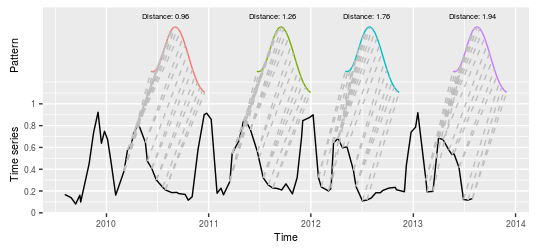
<p class="caption">
Matches of the known temporal pattern to subintervals of the long-term time series. The solid black line is the long-term time series, the colored lines are the different matches of the same pattern ordered by TWDTW dissimilarity measure, and the gray dashed lines are the matching points.
</p>

To use TWDTW for land use and land cover classification, we need the following data sets:

-   A set of remote sensing time series for the study area. For example, a tile of a MODIS MOD13Q1 image consists of 4800 x 4800 pixels, covering an area of 10 degrees x 10 degrees at the Equator \[@Friedl:2010\]. A 15-year (2000-2015) MODIS MOD13Q1 set time series has 23 images per year, with a total of 23 million time series, each with 346 samples.

-   A set of time series with land cover information, called *temporal patterns*. Typically, each time series is short and covers one phenological cycle of one land cover type. Examples would be a time series of a soybean crop, or one that describes a mature tropical forest. These temporal patterns can be extracted from the remote sensing image data, if the user knows their spatial and temporal location.

-   A set of ground truth points, with spatial and temporal information and land cover classification. These *ground truth* points are used for validation and accuracy assessment.

Based on the information provided by the user about the images to be analysed, our method maps them to a three-dimensional (3-D) array in space-time (Figure ). This array can have multiple attributes, such as the satellite bands (*e.g.*, "red", "nir", and "blue"), and derived indices (*e.g.*, "NDVI", "EVI", and "EVI2"). This way, each pixel location is associated to a sequence of measurements, building a satellite image time series. Figure shows an example of "evi" time series for a location in the Brazilian Amazon from 2000 to 2008. In the first two years, the area was covered by forest that was cut in 2002. The area was then used for cattle raising (pasture) for three years, and then for crop production from 2006 to 2008. Satellite image time series are thus useful to describe the dynamics of the landscape and the land use trajectories.

\begin{figure}[!h]
\begin{center} 
  \includegraphics[width=.45\textwidth]{./images_array.pdf}
  \includegraphics[width=.45\textwidth]{./images_ts.pdf}
\end{center}
\caption{A 3-dimensional array of satellite images (left), an enhanced vegetation index (EVI) time series at the pixel location $(x,y)$ (right). The arrows indicate gaps in the time series. Adapted from \citet{Maus:2016}.}
\label{fig:3-D-array}
\end{figure}
dtwSat package overview
=======================

 provides a set of functions for land cover change analysis using satellite image time series. This includes functions to build temporal patterns for land cover types, apply the TWDTW analysis using different weighting functions, visualise the results in a graphical interface, produce land cover maps, and create spatiotemporal plots for land changes. Therefore, gives an end-to-end solution for satellite time series analysis, which users can make a complete land change analysis.

For the package, the user should provide the following inputs:

-   A set of time ordered satellite images, all with the same spatial extent. The user should also inform the date of each image. In the images should use the or class of the  package.
-   A list of temporal patterns, each associated to a time series in  format.

-   A list of known ground truth points, each with spatial and temporal information, in a format readable in , such as CSV or shapefile.

The package organizes the data in three classes of objects: , , and . To store time series we use the class . The objects of class have two slots; the slot called has a list of objects; and the slot called stores the labels of the time series. The class has 3 slots to store inputs and results of the TWDTW analysis. The slots called and are objects of the class with the unclassified long-term time series and the temporal patterns, respectively. A third slot called has a with detailed information about the matches between the patterns and the unclassified long-term time series. The classes and are used to analyse lists of time series.

The class is used for satellite image time series. This class can store either unclassified raster time series with the satellite raw data, the results of the TWDTW analyis, or a classified raster time series. In both cases, the objects of class have five slots. The slot called is a list of or objects with time ordered satellite images (all with the same temporal and spatial extents); the slot called is a vector of class with dates of the satellite images; the slot called has the names of satellite bands; the slot called has levels for the raster values; and the slot called has labels for the raster values. This class builds upon the package to build a multi-attribute 3-D raster in space-time, allowing for multi-band satellite image time series analysis.

Classifying a time series
=========================

This section describes how to classify one time series, using examples that come with the package. We will show how to match three temporal patterns ("soybean", "cotton", and "maize") to subintervals of a long-term satellite image time series. These time series have been extracted from a set of MODIS MOD13Q1 \[@Friedl:2010\] images and include the vegetation indices "ndvi", "evi", and the original bands "nir", "red", "blue", and "mir". In this example, the classification of crop types for the long-term time series is known.

Input data
----------

The inputs for the next examples are time series in format. The first is an object of class with a long-term time series, referred to as , and the second is a of time series of class with the temporal patterns of "soybean", "cotton", and "maize", referred to as .

From objects we construct time series of class , for which we have a set of visualization and analysis methods implemented in the package. The code below builds two objects of class . The first has the long-term time series and second has the temporal patterns. We use the plot method types and to shown the objects in Figure and in Figure , respectively. This plot method uses syntax.

``` r
ts = twdtwTimeSeries(example_ts, labels="Time series")
patterns_ts = twdtwTimeSeries(patterns.list)
example_ts_labels
```

        label       from         to
    1 Soybean 2009-09-01 2010-03-01
    2  Cotton 2010-03-01 2010-09-01
    3 Soybean 2010-09-01 2011-03-01
    4  Cotton 2011-03-01 2011-09-01
    5 Soybean 2011-09-01 2012-03-01
    6   Maize 2012-03-01 2012-09-01
    7 Soybean 2012-09-01 2013-03-01
    8   Maize 2013-03-01 2013-09-01

``` r
library(dtwSat)
names(patterns.list)
```

    [1] "Soybean" "Cotton"  "Maize"  

``` r
head(example_ts, n = 2)
```

                 ndvi    evi    red    nir   blue    mir
    2009-08-05 0.3169 0.1687 0.1167 0.2250 0.0427 0.2193
    2009-08-28 0.2609 0.1385 0.1168 0.1993 0.0548 0.2657

``` r
plot(ts, type = "timeseries") + 
  annotate(geom = "text", x = example_ts_labels$from+90, y = 0.98, 
  label = example_ts_labels$label, size = 2)
```

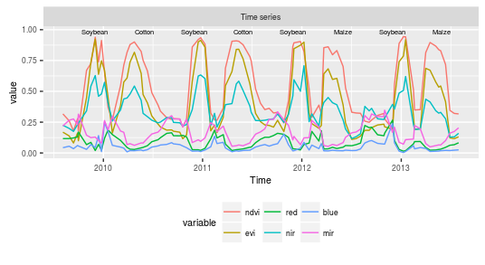
<p class="caption">
Example of time series based on MODIS product MOD13Q1 . The labels of the phenological cycle are shown in the plot.
</p>

``` r
plot(patterns_ts, type = "patterns")
```

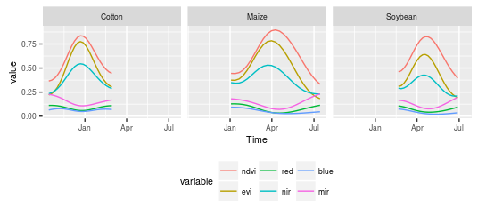
<p class="caption">
Temporal patterns of soybean, cotton, and maize based on MODIS product MOD13Q1 .
</p>

TWDTW uses both amplitude and phase information to classify the phenological cycles in the long-term time series. The EVI peak of the "soybean" time series has a similar amplitude as that of "cotton". However, the "soybean" series peaks in late December while the "cotton" series peaks in early April. The EVI peak of the "maize" time series is at the same period as the peak of "cotton". However, the "maize" time series has smaller amplitude than the "cotton" one. Therefore, we can improve the time series classification by combining shape and time information.

Detection of time series patterns with TWDTW
--------------------------------------------

Each subinterval of the long-term time series in has a known phenological cycle. We will now compare the known information with the result of the TWDTW algorithm. We use the function that returns an object of class with all matches of each temporal pattern in the time series.

``` r
log_weight = logisticWeight(alpha = -0.1, beta = 100)
matches = 
  twdtwApply(x = ts, y = patterns_ts, weight.fun = log_weight, keep=TRUE)
slotNames(matches)
```

    [1] "timeseries" "patterns"   "alignments"

``` r
show(matches)
```

    An object of class "twdtwMatches"
    Number of time series: 1 
    Number of Alignments: 16 
    Patterns labels: Soybean Cotton Maize 

To retrieve the complete information of the matches we set . We need this information for the plot methods of the class . The argument defines the time-weight to the dynamic time warping analysis \[@Maus:2016\]. By default the time-weight is zero, meaning that the function will run a standard dynamic time warping analysis. The arguments and are objects of class with the unclassified long-term time series and the temporal patterns, respectively. For details and other arguments see .

In our example we use a logistic weight function for the temporal constraint of the TWDTW algorithm. This function is defined by . The package provides two in-built functions: and . The function with slope and intercept is given by
*ω* = *a* ⋅ *g*(*t*<sub>1</sub>, *t*<sub>2</sub>)+*b*,
 and the with midpoint , and steepness , given by
$$
    \\omega = \\frac{1}{1 + e^{-\\alpha(g(t\_1,t\_2)-\\beta)} }.
    \\label{eq:nonlineartw}
$$
 The function *g* is the absolute difference in days between two dates, *t*<sub>1</sub> and *t*<sub>2</sub>. The linear function creates a strong time constraint even for small time differences. The logistic function has a low weight for small time warps and significant costs for bigger time warps, cf. Figure . In our previous studies \[@Maus:2016\] the logistic-weight had better results than the linear-weight for land cover classification. Users can define different weight functions as temporal constraints in the argument of the method.
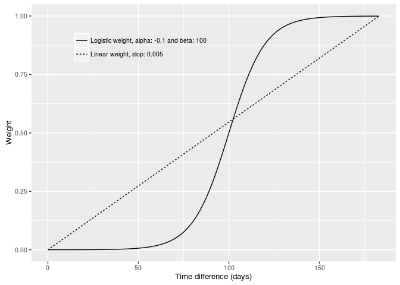
<p class="caption">
Logistic time-weight function with steepness and midpoint . The *x* axis shows the absolute difference between two dates in days and the *y* axis shows the time-weight .
</p>

Visualising the result of the TWDTW algorithm
---------------------------------------------

 provides five ways to visualise objects of class through the plot types: , , , , and . The plot type shows the matching points of the patterns in the long-term time series; the plot type shows the alignments and dissimilarity measures; the plot type shows the low cost paths in the TWDTW cost matrix; and the plot type allows the visualisation of the cost matrices (local cost, accumulated cost, and time cost); and the plot type shows the classification of the long-term time series based on the TWDTW analysis. The plot methods for class return a object, so that users can further manipulate the result using the package. For more details on visualisation functions, please refer to the documentation in the CRAN \[@Maus:2015a\].

We now describe the plot types and . The code bellow shows how to visualise the matching points of the four best matches of "soybean" pattern in the long-term time series, cf. Figure .

``` r
plot(matches, type="matches", patterns.labels="Soybean", k=4)
```

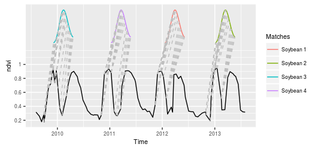
<p class="caption">
The four best matches of the "soybean" pattern in the time series using a logistic time-weight. The solid black line is the long-term time series; the coloured lines are the temporal patterns; and the grey dashed lines are the respective matching points.
</p>

The next example (Figure ) uses the plot type to show the alignments of the temporal patterns. We set the threshold for the dissimilarity measure to be lower than 3.0. This is useful to display the different subintervals of the long-term time series that have at least one alignment whose dissimilarity is less than the specified threshold.

``` r
plot(matches, type="alignments", attr = "evi", threshold = 3.0)
```

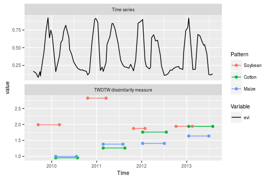
<p class="caption">
Alignments and dissimilarity measures of the patterns "soybean", "cotton", and "maize" to the subintervals of the long-term time series using a logistic time-weight. The solid black line is the EVI time series, and the coloured lines are the alignments of the patterns that have dissimilarity measure lower than three.
</p>

Classifying the long-term time series
-------------------------------------

Using the matches and their associated dissimilarity measures, we can classify the subintervals of the long-term time series using . To do this, we need to define a period for classification and the minimum overlap between the period and the alignments that intersect with it. We use the plot type to show the classification of the subintervals of the long-term time series based on the TWDTW analysis. For this example, we set classification periods of 6 months from September 2009 to September 2013, and a minimum overlap of 50% between the alignment and the classification period. This means that at least 50% of the alignment has to be contained inside of the classification period.

``` r
ts_classification = twdtwClassify(x = matches, 
  from = as.Date("2009-09-01"), to = as.Date("2013-09-01"), 
  by = "6 month", overlap = 0.5)
plot(ts_classification, type="classification")
```

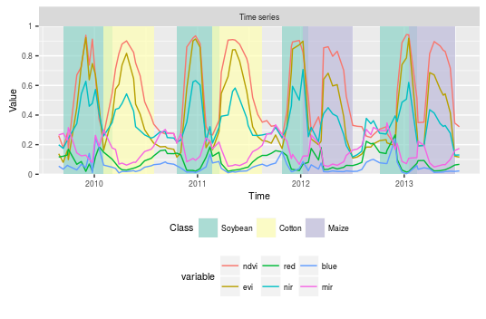
<p class="caption">
Classification of each 6 months periods of the time series using results of the TWDTW analysis with logistic time-weight. The solid lines are the attributes of the time series, the background colours indicate the classification of the periods.
</p>

Comparing the results of the classified time series in Figure with the crop cycles in Figure we see that the algorithm has classified correctly all the eight subintervals from 2009 to 2013, which are, respectively: "Soybean", "Cotton", "Soybean", "Cotton", "Soybean", "Maize", "Soybean", "Maize".

Producing a land cover map
==========================

In this section we present an application of TWDTW for land use and land cover change analysis using satellite image time series. Our input is a set of images, each covering the same geographical area at different times. Each pixel location is then associated to an unclassified satellite image time series. We assume to have done field work in the area; for some pixel locations and time periods, we know what is the land cover. We then will show how to obtain a set of template patterns, based on the field samples and how to apply these patterns to land cover classification of the set of images. In the end of this section we show how to perform land cover change analysis and how to do accuracy assessment. The satellite images and the field samples used in the examples come with package.

Our method is not restricted to cases where the temporal patterns are obtained from the set of images. The patterns for the TWDTW analysis can be any time series with same bands or indices as the unclassified images, such as in the examples of Section above.

Input data
----------

The inputs are: *a)* the satellite images for a given geographical area, organised as a set of georeferenced raster files in GeoTIFF format, each containing all time steps of a spectral band or index; and *b)* a set of ground truth samples. The satellite images are extracted from the MODIS product MOD13Q1 collection 5 \[@Friedl:2010\] and include vegetation indexes "ndvi", "evi", and original bands "nir", "red", "blue", and "mir". This product has 250 x 250 m spatial and 16 day temporal resolution.

The region is a tropical forest area in Mato Grosso, Brazil of approximately 5300 km**<sup>2</sup> with images from 2007 to 2013 (Figure ). This is a sequence of 160 images with 999 pixels each for 6 years. We also have a set of 603 ground truth samples of the following classes: "forest", "cotton-fallow", "soybean-cotton", "soybean-maize", and "soybean-millet".

\begin{figure}[!h]
\begin{center} 
  \includegraphics[width=\textwidth]{./study_area.pdf}
\end{center}
\caption{Study area in Mato Grosso, Brazil, shown in a \copyright\ Google Earth image. The area was originally covered by tropical forest that has been removed for agricultural use.}
\label{fig:study-area}
\end{figure}
The data files for the examples that follow are in the installation folder *lucc\_MT/data/*. The *tif* files include the time series of "blue", "red", "nir", "mir", "evi", "ndvi", and "doy" (day of the year); the text file *timeline* has the dates of the satellite images; the CSV file *samples.csv* has the , , , , and for each field sample; and the text file *samples\_projection* contains information about the cartographic projection of the samples, in the format of coordinate reference system used by .

``` r
data_folder = system.file("lucc_MT/data", package = "dtwSat")
dir(data_folder)
```

     [1] "blue.tif"           "doy.tif"            "evi.tif"           
     [4] "mir.tif"            "ndvi.tif"           "nir.tif"           
     [7] "red.tif"            "samples.csv"        "samples_projection"
    [10] "timeline"          

In this example, we have stored all the time series for each band in one single file. In this way, we can use the function to read the satellite images. The algorithm also works when the time steps for each band are split in many files. In this case, the user should call the function with the appropriate parameters. Because of processing performance, we suggest that interested users group their images in bricks and follow the procedures given below.

``` r
blue = brick(paste(data_folder,"blue.tif", sep = "/"))
red  = brick(paste(data_folder,"red.tif", sep = "/"))
nir  = brick(paste(data_folder,"nir.tif", sep = "/"))
mir  = brick(paste(data_folder,"mir.tif", sep = "/"))
evi  = brick(paste(data_folder,"evi.tif", sep = "/"))
ndvi = brick(paste(data_folder,"ndvi.tif", sep = "/"))
day_of_year  = brick(paste(data_folder,"doy.tif", sep = "/"))
dates = scan(paste(data_folder,"timeline", sep = "/"), what = "dates")
```

The set of ground truth samples in the CSV file *samples.csv* has a total of 603 samples divided in five classes: 68 "cotton-fallow", 138 "forest", 79 "soybean-cotton", 134 "soybean-maize", and 184 "soybean-millet". Reading this CSV file, we get a object, with the spatial location ( and ), starting and ending dates ( and ), and the for each sample.

``` r
field_samples = read.csv(paste(data_folder,"samples.csv", sep = "/"))
head(field_samples, 2)
```

      longitude  latitude       from         to         label
    1 -55.98819 -12.03646 2011-09-01 2012-09-01 Cotton-fallow
    2 -55.99118 -12.04062 2011-09-01 2012-09-01 Cotton-fallow

``` r
table(field_samples[["label"]])
```


     Cotton-fallow         Forest Soybean-cotton  Soybean-maize Soybean-millet 
                68            138             79            134            184 

``` r
proj_str = scan(paste(data_folder,"samples_projection", sep = "/"), 
  what = "character")
proj_str
```

    [1] "+proj=longlat +datum=WGS84 +no_defs +ellps=WGS84 +towgs84=0,0,0"

Creating the time series and the temporal patterns
--------------------------------------------------

After reading our data, we need to create the time series for analysis. For this purpose, provides the constructor that builds a multi-band satellite image time series. The inputs of this function are objects with the same temporal and spatial extents, and a vector () with the acquisition dates of the images in the format . The argument is optional. If is not declared, the function builds a object using the dates given by . This function produces an object of class with the time series of multiple satellite bands.

``` r
raster_timeseries = twdtwRaster(blue, red, nir, mir, evi, ndvi, 
  timeline = dates, doy = day_of_year)
```

We now need to identify the temporal patterns. Usually, this can be done using the collected field samples. In the next example we use the function to get the time series of each field sample from our raster time series. The arguments of the function are a set of raster time series, a with spatial and temporal information about the fields samples (as in the object given above), and a with the projection information. The projection should follow the format. The result is an object of class with one time series for each field sample.

``` r
field_samples_ts = getTimeSeries(raster_timeseries, 
  y = field_samples, proj4string = proj_str)
field_samples_ts
```

    An object of class "twdtwTimeSeries"
    Slot "timeseries" length: 603 
    Slot "labels": [1] Cotton-fallow Cotton-fallow Cotton-fallow
    5 Levels: Cotton-fallow Forest Soybean-cotton ... Soybean-millet

After obtaining the time series associated to the field samples, we need to create the template patterns for each class. For this purpose, provides the function . This function fits a Generalized Additive Model (GAM) \[Hastie:1986,Wood:2011\] to the field samples and retrieves a smoothed temporal pattern for each band (*e.g.*, "blue", "red", "nir", "mir", "evi", and "ndvi"). We use the GAM because of its flexibility for non-parametric fits, with less rigorous assumptions on the relationship between response and predictor. This potentially provides better fit to satellite data than purely parametric models, due to the data's inter- and intra-annual variability.

To produce the set of template patterns using the function , we need to set the temporal frequency of the resulting patterns and the smoothing function for the GAM model. In the example below, we set to get temporal patterns with a frequency of 8 days. We also set the GAM smoothing formula to be , where function sets up a spline model, with the time and a satellite band (for details see and ).

``` r
temporal_patterns = 
  createPatterns(field_samples_ts, freq = 8, formula = y ~ s(x))
```

We use the plot method to show the results of the in .

``` r
plot(temporal_patterns, type = "patterns") + 
  theme(legend.position = c(.8,.25))
```

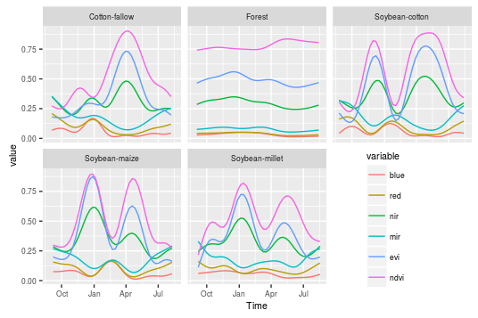
<p class="caption">
Temporal patterns of forest, cotton-fallow, soybean-cotton, soybean-maize, and soybean-millet based on the ground truth samples.
</p>

After obtaining the template patterns for each land cover class, it is useful to perform a pre-classification analysis to assess their quality and their informational content. Ideally, one would need template patterns that, when applied to the set of unknown time series, produce consistent results. For this reason, it is advisable that the user performs a pre-classification step, along the lines of the individual analysis described in Section . In this way, the users would assess how good their patterns are before classifying a large data set.

Classifying the image time series
---------------------------------

After obtaining a consistent set of temporal patterns, we use the function to run the TWDTW analysis for each pixel location in the raster time series. The input raster time series in the object should be longer or have approximatly the same length as the temporal patterns. This function retrieves an object of class with the TWDTW dissimilarity measure of the temporal patterns for each time period. The arguments and are passed to . The arguments and are described in Section . Here we set the parameters of the time weight (logistic function) base on our the experience about the phenological cycle of the vegetation in the study area. In the next example, we classify the raster time series using the temporal patterns in obtained as described above. The result is a with five layers; each layer contains the TWDTW dissimilarity measure for one temporal pattern over time. We use the plot type to illustrate the TWDTW dissimilarity for each temporal pattern in 2013, cf. Figure .

``` r
log_fun = logisticWeight(alpha=-0.1, beta=50) 
twdtw_dist = twdtwApply(x = raster_timeseries, y = temporal_patterns, 
  overlap = 0.5, weight.fun = log_fun, overwrite=TRUE, format="GTiff")
```

    [1] "Procesing chunk 1/1"

<!--
# Processing time 
log_fun = logisticWeight(alpha=-0.1, beta=50) 
t1 = system.time(
twdtw_dist <- twdtwApply(x = raster_timeseries, y = temporal_patterns, 
             from = as.Date("2007-09-01"), to = as.Date("2013-09-01"),
             by = "12 month", overlap = 0.5, weight.fun = log_fun, 
             overwrite=TRUE, format="GTiff")
)
t2 = system.time(
twdtw_dist <- twdtwApply(x = raster_timeseries, y = temporal_patterns, 
             from = as.Date("2007-09-01"), to = as.Date("2013-09-01"),
             by = "12 month", overlap = 0.5, weight.fun = log_fun, 
             overwrite=TRUE, format="GTiff",mc.cores=4)
)
t1/60
#      user     system    elapsed 
#2.21983333 0.01438333 2.47126667 

t2/60
#      user     system    elapsed 
#3.97525000 0.06543333 1.38298333 
-->
``` r
plot(x = twdtw_dist, type="distance", time.levels = 6)
```

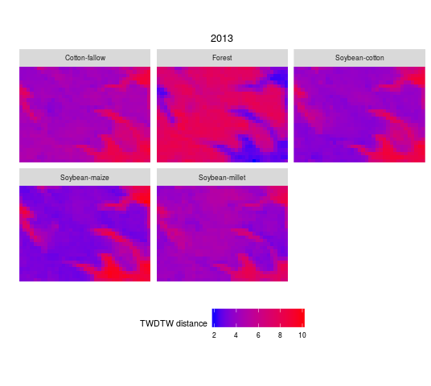
<p class="caption">
Illustration of the TWDTW dissimilarity from each temporal pattern in 2013. The blue areas are more similar to the pattern and the red areas are less similar to the pattern.
</p>

The results of the example above can be used to create categorical land cover maps. The function selects the most similar pattern for each time period and retrieves a object with the time series of land use maps. The resulting object includes two layers, the first has the classified categorical maps and the second has the TWDTW dissimilarity measure.

``` r
land_use_maps = twdtwClassify(twdtw_dist, format="GTiff", overwrite=TRUE)
```

Looking at the classification results
-------------------------------------

The classification results can be visualised using the methods of the class , which supports four plot types: "maps", "area", "changes", and "distance". The shows the land cover classification maps for each period, cf. Figure .

``` r
plot(x = land_use_maps, type = "maps")
```

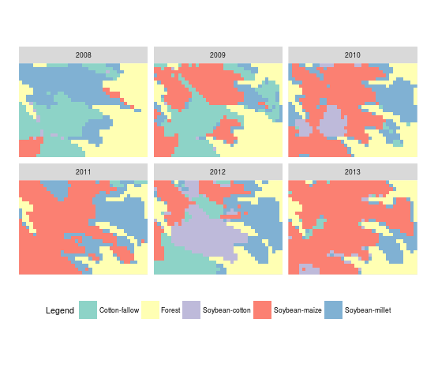
<p class="caption">
Land use maps for each year from 2008 to 2013.
</p>

The next example shows the accumulated area for each class over time, using , cf. Figure .

``` r
plot(x = land_use_maps, type = "area")
```

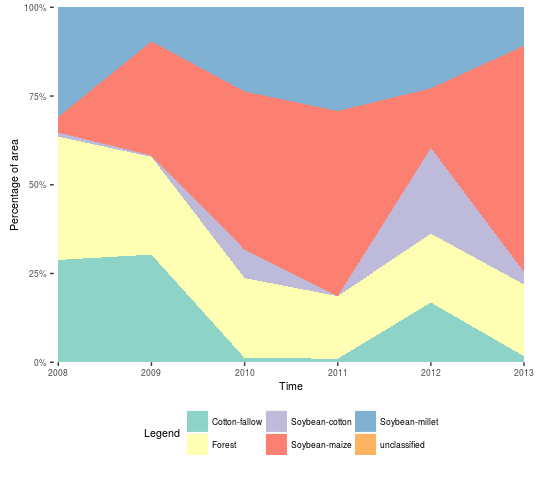
<p class="caption">
Percentage of area for each land use class from 2008 to 2013.
</p>

Users can also view the land cover transition for each time period, by setting . For each land cover class and each period, the plot shows gains and losses in area from the other classes. This is the visual equivalent of a land transition matrix, cf. Figure .

``` r
plot(x = land_use_maps, type = "changes")
```

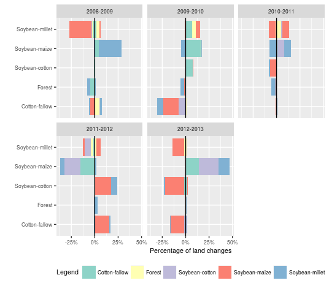
<p class="caption">
Gains and losses in area from the other classes. The *y* axis shows the actual class; the positive direction of *x* axis shows the gains and the negative direction of *x* axis shows the losses of the classes indicated in *y*. The colors indicate from/to which classes the gains/losses belong.
</p>

We can also look at the dissimilarity of each classified pixel setting . This plot can give a measure of the uncertainty of the classification of each pixel for each time period, cf. Figure .

``` r
plot(x = land_use_maps, type="distance")
```

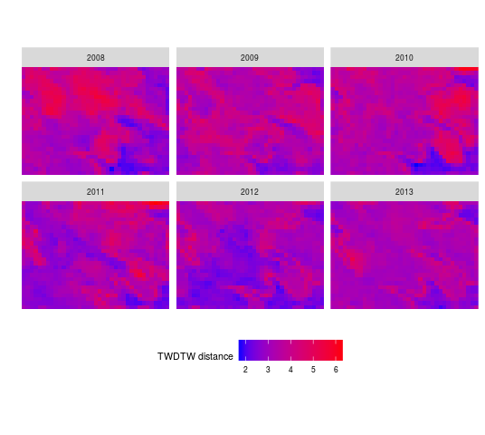
<p class="caption">
TWDTW dissimilarity measure for each pixel over each classified period. The blue areas have high confidence and the red areas have low confidence in the classification.
</p>

Assessing the classification accuracy
-------------------------------------

In this section we show how to assess the accuracy of the TWDTW method for land cover classification. To do this, we split the ground truth samples into training and validation sets, using the function from the package . This function splits set of time series in the object for training and validation. The argument defines the percentage used for training and the argument gives the number of different partitions to create. This is a a stratified sampling with a simple random sampling within each stratum, see for details. In the next example we create 100 different partitions of the data. Each partition uses 10% of the data for training and 90% for validation. The output is a list with 100 different data partitions; each partition has the temporal patterns based on the training samples and a set of time series for validation.

``` r
set.seed(1)
partitions = splitDataset(field_samples_ts, p=0.1, times=100, 
  freq = 8, formula = y ~ s(x, bs="cc"))
```

For each data partition we run the TWDTW analysis to classify the set of validation time series using the trained temporal patterns. The result is a list of objects with the classified set of time series for each data partition. To compute the *User's Accuracy* (UA) and *Producer's Accuracy* (PA) of the classified time series we use the function that retrieves a with the accuracy assessment for all data partitions.

``` r
log_fun = logisticWeight(alpha=-0.1, beta=50) 
twdtw_res = lapply(partitions, function(x){
  res = twdtwApply(x = x$ts, y = x$patterns, weight.fun = log_fun, n=1)
  twdtwClassify(x = res)
})
assessment = twdtwAssess(twdtw_res)
head(assessment, 5)
```

<!--
t1 = system.time(
  twdtw_res <- lapply(partitions, function(x){
    res = twdtwApply(x = x$ts, y = x$patterns, weight.fun = log_fun, n=1)
    twdtwClassify(x = res)
  })
)
t1/60
#       user      system     elapsed 
# 51.86498333  0.01046667 51.85880000 

t2 = system.time(
  assessment <- twdtwAssess(twdtw_res)
)
t2/60
#         user       system      elapsed 
# 3.0679500000 0.0004333333 3.0651333333
-->
Figure shows the average *μ* and standard deviation *σ* of *user's* and *producer's accuracy* based on a bootstrap simulation of 100 different data partitions using resampling-with-replacement. The *user's accuracy* gives the confidence and the *producer's accuracy* gives the sensitivity of the method for each class. In our analysis all classes had high *user's* and *producer's accuracy*, meaning that TWDTW has high confidence and sensitivity for the classes included in the analysis. The average, standard deviation, and the 99% confidence interval is also shown in Table .
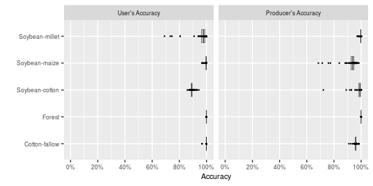
<p class="caption">
User's Accuracy (UA) and Producer's Accuracy (PA) of the TWDTW method for land cover classification. The plot shows the averages and their confidence interval for 99%.
</p>

\begin{table}[ht]
\centering
\begin{tabular}{ccccccc}
  \hline
  Class & \multicolumn{3}{c}{User's Accuracy (UA) \%} & \multicolumn{3}{c}{Producer's Accuracy (PA)\%}\\ &$\mu$&$\sigma$&CI&$\mu$&$\sigma$&CI \\ \hline
Cotton-fallow & 99.93 & (0.46) & [99.80-100.00] & 95.99 & (1.19) & [95.68-96.27] \\ 
  Forest & 100.00 & (0.00) & [100.00-100.00] & 100.00 & (0.00) & [100.00-100.00] \\ 
  Soybean-cotton & 89.10 & (1.85) & [88.65-89.55] & 99.07 & (3.28) & [97.95-99.72] \\ 
  Soybean-maize & 99.73 & (0.74) & [99.54-99.89] & 93.85 & (4.76) & [92.43-94.90] \\ 
  Soybean-millet & 97.72 & (5.44) & [96.18-98.95] & 99.79 & (0.56) & [99.63-99.92] \\ 
   \hline
\end{tabular}
\caption{User's and Producer's Accuracy of the land use classification based on TWDTW analysis. $\mu$ is the average accuracy, $\sigma$ the standard deviation, and CI is the confidence interval of 99\% using 100 resampling-with-replacement.} 
\label{tab:assessment}
\end{table}
Conclusions and Discussion
==========================

Nowadays, there are large open archives of Earth Observation data, but few open source methods for analysing them. With this motivation, this paper provides guidance on how to use the Time-Weighed Dynamic Time Warping (TWDTW) method for remote sensing applications. As we have discussed in a companion paper \[@Maus:2016\], the TWDTW method is well suited for land cover change analysis of satellite image time series.

The main goal of package is to make TWDTW accessible for researchers. The package supports the full cycle of land cover classification using image time series, ranging from selecting temporal patterns to visualising and evaluating the results. The current version of the package provides a pixel-based time series classification method. We envisage that future versions of the package could include local neighborhoods to reduce border effects and improve classification homogeneity.

The package provides two in-built functions for linear and logistic time weight. In the current version of the package the parameters of the weight functions are set manually to the same value for all land use/cover classes. Future versions of the package could include methods to search for the best parameters to be set class-by-class using field data.

To aim for maximum usage by the scientific community, the package described in this paper works with well-known R data classes such as provided by packages and . We are planning improvements, so that can be combined with array databases, such as SciDB \[@Stonebraker:2013\]. We believe that combining array databases with image time series analysis software such as presented here is one way forward to scaling the process of information extracting to very large Earth Observation data.

\section*{Acknowledgments}
Victor Maus has been supported by the Institute for Geoinformatics, University of Münster (Germany), and by the Earth System Science Center, National Institute for Space Research (Brazil). Part of the research was developed in the Young Scientists Summer Program at the International Institute for Applied Systems Analysis, Laxenburg (Austria). Gilberto Camara's term as Brazil Chair at IFGI has been supported by CAPES (grant 23038.007569/2012-16). Gilberto's work is also supported by FAPESP e-science program (grant 2014-08398-6) and CNPq (grant 312151/2014-4).

\bibliography{references}
